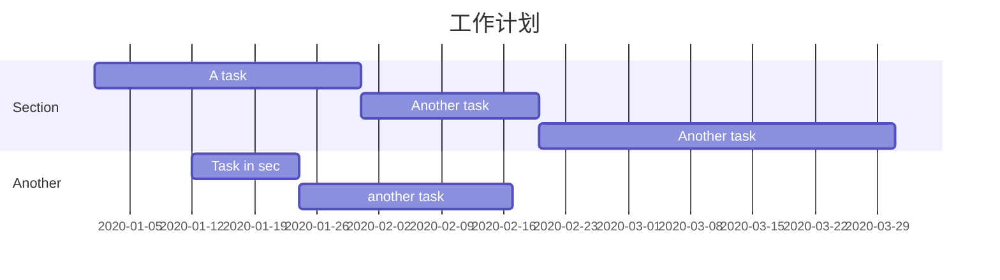
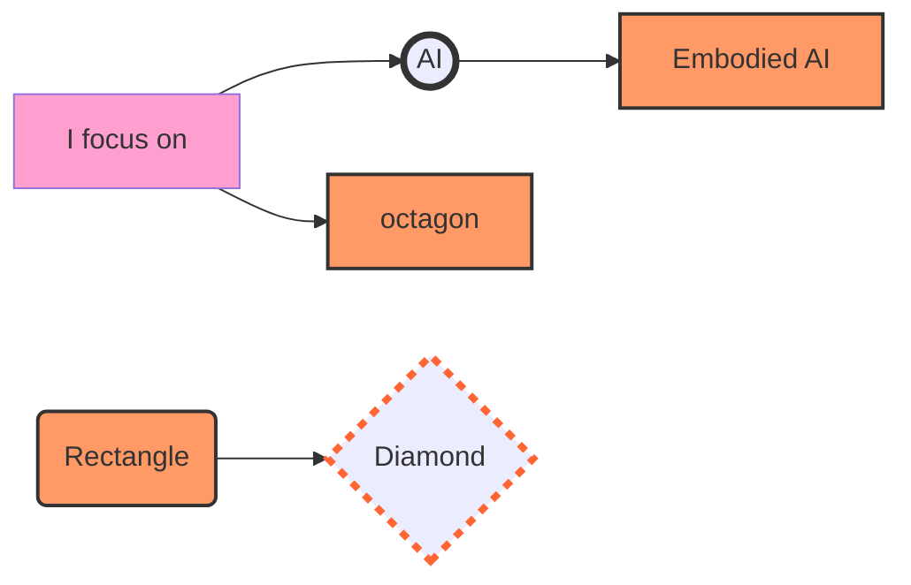

个人主页
https://wendellgong.github.io/  
PID模拟器小工具
https://wendellgong.github.io/pid-simulator

```mermaid
gantt
    
    title 工作计划
    dateFormat  YYYY-MM-DD
    section Section
    A task           :a1, 2020-01-01, 30d
    Another task     :after a1  , 20d
    Another task     :40d
    section Another
    Task in sec      :2020-01-12  , 12d
    another task      : 24d
```

```mermaid
graph LR
  A[I focus on] --> B((AI));
  A --> C[octagon];
  B --> D[Embodied AI];
  E(Rectangle) --> F{Diamond};

  style A fill:#ff9fcf;
  style B stroke:#333,stroke-width:4px;
  style C fill:#f96,stroke:#333,stroke-width:2px;
  style D fill:#f96,stroke:#333,stroke-width:2px;
  style E fill:#f96,stroke:#333,stroke-width:2px;
  style F # fill:#fc9,stroke:#f63,stroke-width:4px,stroke-dasharray: 5 5;
```